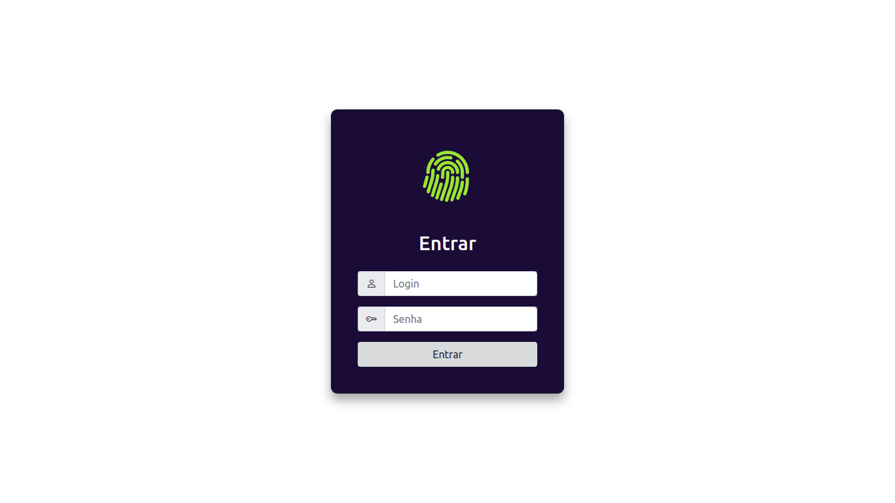
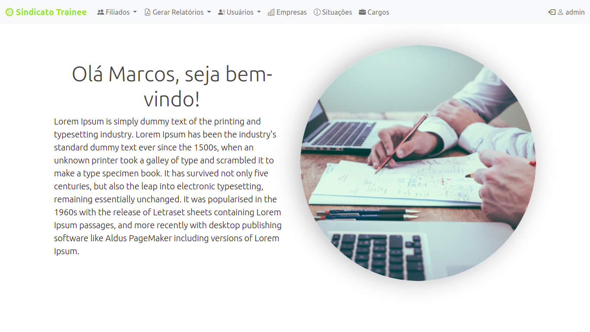
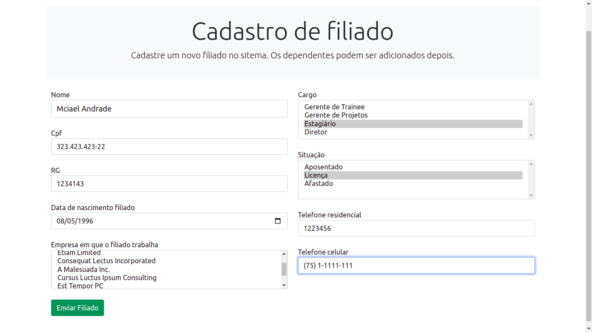
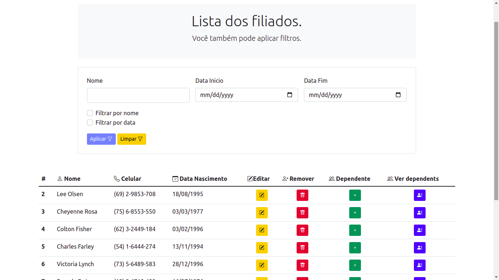
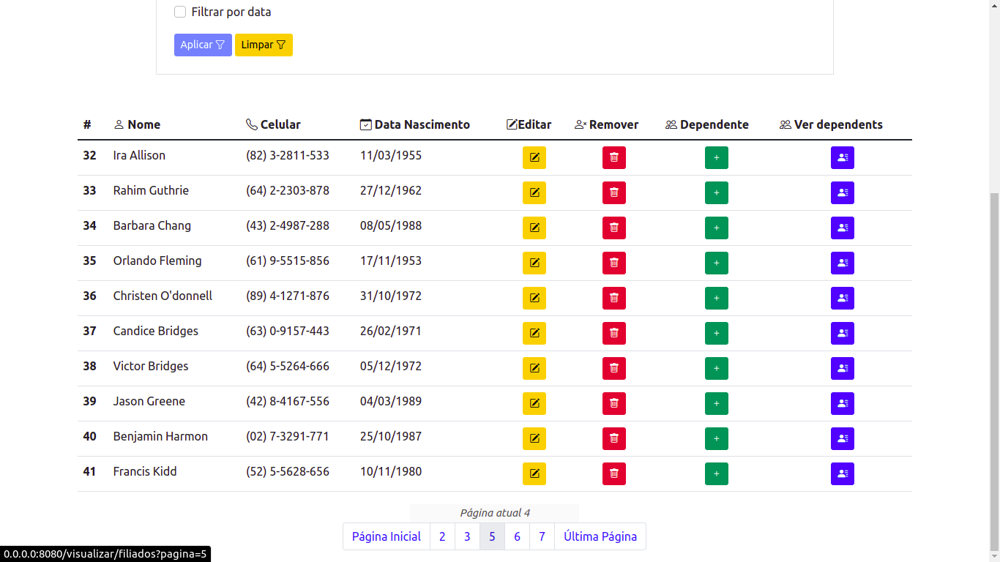
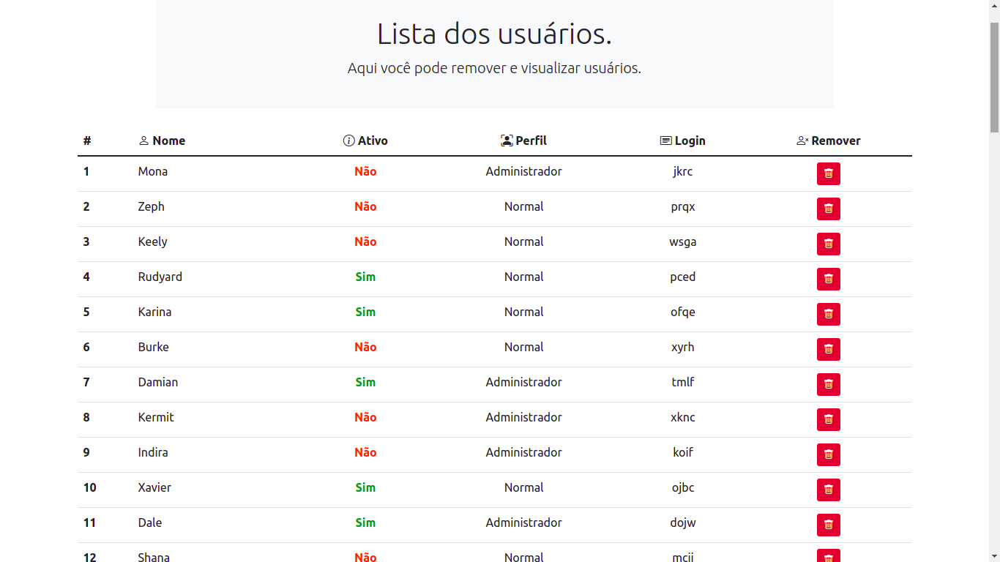
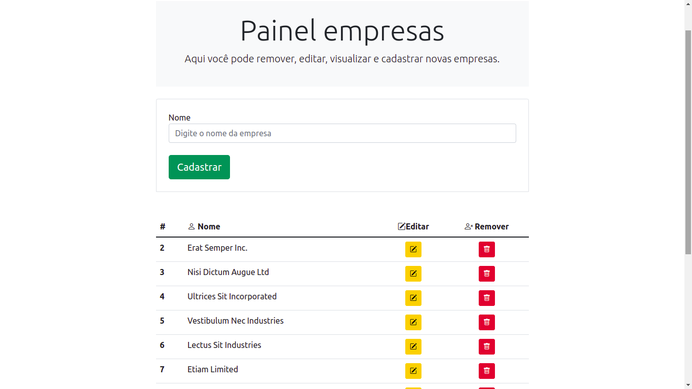
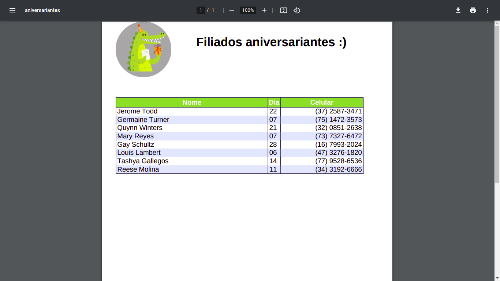

# Avaliação

Preparado por Pedro Neto
## Overview & Propósito
Avaliação referente aos dois primeiros módulos.

### Padrões
1. Seguir o padrão de codificação da Moobi Tech.
2. Você pode aproveitar código dos módulos anteriores.
3. Os dados do projeto deverão ser persistidos no banco de dados Mysql no servidor de desenvolvimento em um banco de dados que deve possuir o seu nome.
### Objetivos Específicos
1. 1 Avaliar os conhecimentos já passados nos módulos do programa de trainee

### Estudo de Caso
Você foi contratado para desenvolver um sistema para o Sindicato dos Trainees, seu contratante passou as necessidades dele para você utilizar na construção do sistema.  São elas:

1. O sistema deverá ter uma tela de entrada onde o usuário deverá informar um login e senha para acessar, deve haver um usuário pré-cadastrado no banco de dados com login “admin” e senha “123456”.

2. O sistema deverá ter um menu para poder acessar as funcionalidades do mesmo.

3. O sistema deverá fazer o cadastro e controle de usuários do mesmo, onde teremos um usuário administrador que pode realizar qualquer ação no sistema e demais usuários, estes não podem acessar o cadastro de usuário. No cadastro de usuário deverá ser permitido escolher se ele é administrador ou não.

4. O sistema deverá gerenciar o cadastro de filiados da entidade que possui os seguintes campos: Nome, CPF, RG, data de nascimento, idade, empresa em que o filiado trabalha, cargo, situação (ativo, aposentado, licenciado, etc), telefones residencial e celular, data da última atualização e os dados referentes aos dependentes daquele determinado filiado (nome, data de nascimento, grau de parentesco). Foi uma solicitação do cliente que todos os dados desse cadastro ficassem em uma tela única para que ele pudesse ter mais agilidade na utilização do sistema.

5. O cliente também pediu para que as empresas, cargos e situações no sistema pudessem ser cadastrados, atualizados e removidos para que ele não tivesse que solicitar ao desenvolvedor para inserir no sistema.

6. O cliente pediu para que os dados digitados fossem validados para não permitir entrada de dados incorretos (validar apenas no PHP).

7. Crie um filtro na tela de consulta de filiados. Os campos a serem filtrados são: nome do filiado e mês de nascimento.

## Pontos Avaliados
*  Proibido acessar diretamente as globais $_SESSION, $_GET e $_POST.
*  Funcionalidades implementadas
*  Validação das informações no sistema
*  Entrada no sistema (login)
*  Validação de privilégio de administrador no cadastro de usuários
*  Separação das camadas no código do projeto (MVC)
*  URLs amigáveis (não deixar visível que o sistema é feito em PHP)
*  Organização do código do sistema
*  Indentação no projeto
*  Paginação dos resultados nas listagens(utilizar no próprio PHP)
*  Facilidade e velocidade para adicionar e manter novas funcionalidades no sistema.

## Classes Necessárias
* Classe para gerenciar o acesso a sessão. Qualquer acesso direto a global $_SESSION será cortado.
* Classe para gerenciar as configurações do sistema. As mesmas deve ser recuperadas de um arquivo .json
* Classe genérica para gerenciar o acesso ao banco de dados e facilitar uma futura refatoração.

## Resultado Telas

## Tecnologias, Framework, Libs e Ferramentas utilizadas.
- Docker
- Php
- MySQL
- Apache
- Bootstrap
- JavaScript
- jQuery
- Unsplash
- Inkscape
- MVC
- CSS
- MySQL Workbench
- FPDF
